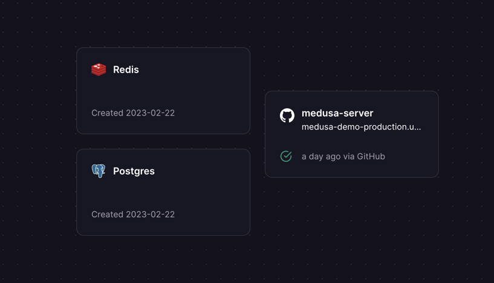

# Webshop starter Medusajs + turborepo

This is an official starter for [Medusa](https://medusa-commerce.com) using [Turborepo](https://turbo.build/repo).

## Required backend services

- [Railway](https://railway.app) - for hosting the Medusa server, Postgres and Redis.
- [Digital Ocean](https://digitalocean.com) - for storing images in a bucket.
- [Sendgrid](https://sendgrid.com) - for sending emails.
- [Stripe](https://stripe.com) - for payments.

## Required frontend services
- [Vercel](https://vercel.com) - for hosting the admin.  
- [Netlify](https://netlify.com) - for hosting the frontend.

## Optional services
- [Algolia](https://algolia.com) - for search.
- [Meilisearch](https://meilisearch.com) - for search.
- [Sentry](https://sentry.io) - for error tracking.
- [Google Analytics](https://analytics.google.com) - for analytics.

## Railway setup

